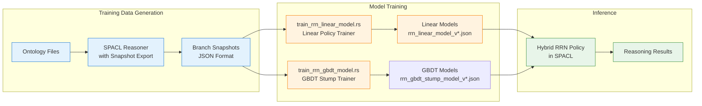
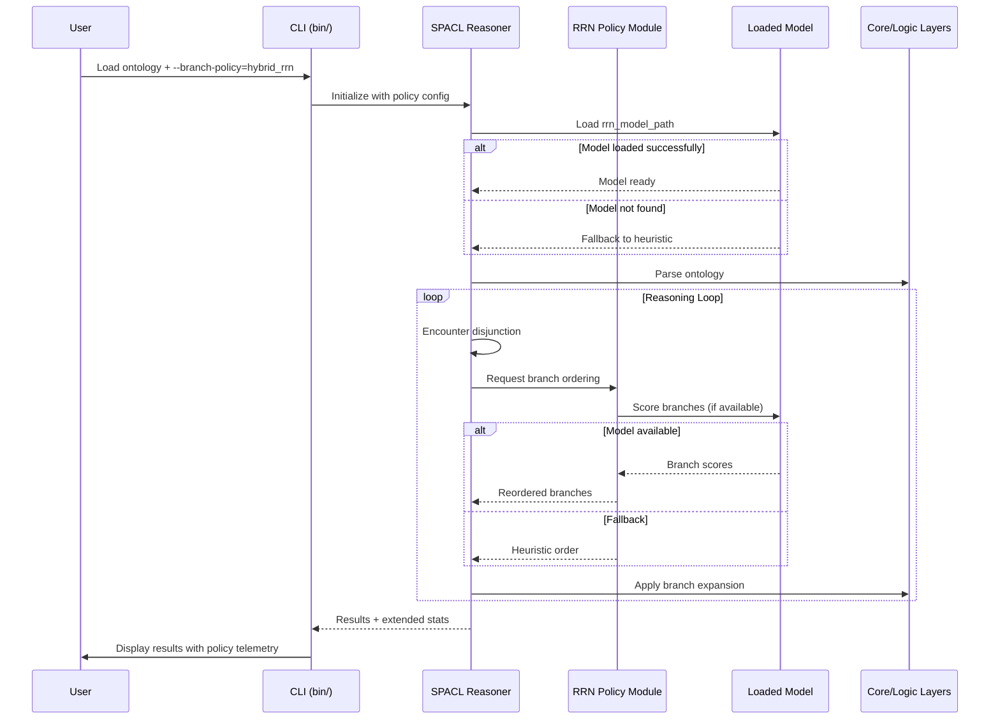

# OWL2 Reasoner (Tableauxx) - Module Architecture
## Branch: `exp/hybrid-rrn-paper`

> **Note:** This documentation describes the experimental branch with Hybrid RRN (Neural Related Reasoning) policy integration. For the stable main branch architecture, see `MODULE_ARCHITECTURE_MAIN.md`.

---

## Executive Summary

Tableauxx is a high-performance OWL2 DL reasoning engine featuring the novel **SPACL algorithm** (Speculative Parallel Tableaux with Adaptive Conflict Learning). This branch (`exp/hybrid-rrn-paper`) extends the base SPACL implementation with **learned branch-priority policies** using hybrid RRN (Neural Related Reasoning) techniques.

### Key Additions in This Branch

1. **Branch Policy System**: Configurable branch ordering with three modes:
   - `Baseline` - Ontology operand order
   - `Heuristic` - Deterministic structural ranking
   - `HybridRrn` - Learned model-based ranking (linear or GBDT)

2. **RRN Model Integration**: Support for loading pre-trained models from JSON files

3. **Training Pipeline**: Scripts for offline model training from branch snapshots

4. **Extended Telemetry**: Policy-specific metrics in reasoning statistics

---

## Architecture Layers

### Layer 0: Foundation (`util`, `storage`)
Cross-cutting concerns and infrastructure: caching, configuration, memory management, I/O, and storage backends.

### Layer 1: Core Types (`core`)
Fundamental building blocks: IRI, entities (Class, Property, Individual), Ontology structure, and error handling.

### Layer 2: Logic (`logic`)
OWL2 logical constructs: axioms, class expressions, property expressions, and datatypes.

### Layer 3: Parsing (`parser`)
Multi-format input handling: Turtle, RDF/XML, OWL/XML, JSON-LD, Manchester Syntax, OWL Functional Syntax.

### Layer 4: Reasoning (`reasoner`)
Reasoning engines: Simple (cached), Tableaux (traditional), **SPACL with Hybrid RRN Policy**, and classification engines.

### Layer 5: Strategy (`strategy`)
Intelligent optimization: meta-reasoning, evolutionary tuning, profile validation (EL/QL/RL), and reasoner routing.

### Layer 6: Application (`app`, `serializer`, `bin`)
Domain-specific applications (EPCIS), serialization formats, and CLI executables.

### Layer 7: Training & Models (`scripts`, `benchmarks/models`)
**NEW in this branch**: RRN model training scripts and pre-trained model files.

---

## Complete Module Dependency Flowchart

```mermaid
flowchart TD
    subgraph L7["Layer 7: Training & Models (NEW)"]
        SCRIPTS["scripts/<br/>Training Binaries"]
        TRAINLIN["train_rrn_linear_model.rs<br/>Linear Model Trainer"]
        TRAINGBDT["train_rrn_gbdt_model.rs<br/>GBDT Stump Trainer"]
        ABLATION["run_spacl_synthetic_ablation.rs<br/>Ablation Study Runner"]
        MODELS["benchmarks/models/<br/>Pre-trained Models"]
        MODLIN["rrn_linear_model_v*.json<br/>Linear Policy Models"]
        MODGBDT["rrn_gbdt_stump_model_v*.json<br/>GBDT Stump Models"]
        SCRIPTS --> TRAINLIN & TRAINGBDT & ABLATION
        MODELS --> MODLIN & MODGBDT
    end

    subgraph L6["Layer 6: Application & Interfaces"]
        BIN["bin/ - CLI Executables"]
        OWL2BIN["owl2-reasoner.rs<br/>+ Policy CLI flags"]
        APP["app/ - EPCIS Domain"]
        SER["serializer/ - Binary Format"]
    end

    subgraph L5["Layer 5: Strategy & Optimization"]
        STRAT["strategy/"]
        META["meta_reasoner.rs - ML Strategy Selection"]
        EVO["evolutionary.rs - Evolutionary Optimization"]
        PROF["profiles/ - EL/QL/RL Validation"]
        ROUTE["reasoner_router.rs - Routing Decisions"]
        STRAT --> META & EVO & PROF & ROUTE
    end

    subgraph L4["Layer 4: Reasoning Engines"]
        REAS["reasoner/"]
        SIMPLE["simple.rs - Cached Simple Reasoner"]
        SPACL["speculative.rs - SPACL + Hybrid RRN Policy<br/>★ ENHANCED IN THIS BRANCH"]
        TAB["tableaux/ - Traditional Tableaux"]
        CLASS["classification.rs - Classification"]
        HIER["hierarchical_classification.rs"]
        CONS["consistency.rs - Consistency Checking"]
        REAS --> SIMPLE & SPACL & TAB & CLASS & HIER & CONS
    end

    subgraph L3["Layer 3: Parsing"]
        PARSE["parser/"]
        TTL["turtle.rs - Turtle Parser"]
        RDF["rdf_xml*.rs - RDF/XML Parsers"]
        OWLXML["owl_xml.rs - OWL/XML Parser"]
        JSONLD["json_ld/ - JSON-LD Parser"]
        MANCH["manchester/ - Manchester Syntax"]
        OWLFUN["owl_functional/ - OWL Functional Syntax"]
        PARSE --> TTL & RDF & OWLXML & JSONLD & MANCH & OWLFUN
    end

    subgraph L2["Layer 2: Logic"]
        LOGIC["logic/"]
        AXIOM["axioms/ - All Axiom Types"]
        DATATYPE["datatypes/ - Datatype Definitions"]
        LOGIC --> AXIOM & DATATYPE
    end

    subgraph L1["Layer 1: Core Types"]
        CORE["core/"]
        IRI["iri.rs - IRI with Caching"]
        ENT["entities.rs - OWL2 Entities"]
        ONT["ontology.rs - Ontology Structure"]
        ERR["error.rs - OwlError/OwlResult"]
        CORE --> IRI & ENT & ONT & ERR
    end

    subgraph L0["Layer 0: Infrastructure"]
        UTIL["util/"]
        CACHE["cache.rs / cache_manager.rs"]
        CONFIG["config.rs - Configuration"]
        MEM["memory.rs / memory_protection.rs"]
        IO["ontology_io.rs - I/O Utilities"]
        PROFILING["profiling/ - Memory Profiling"]
        UTIL --> CACHE & CONFIG & MEM & IO & PROFILING
        
        STORE["storage/ - Storage Backend Trait"]
    end

    %% Cross-layer dependencies
    L7 --> SPACL
    BIN --> OWL2BIN & APP & SER & STRAT & REAS & PARSE
    APP --> REAS & PARSE & LOGIC & CORE
    SER --> LOGIC & CORE
    STRAT --> REAS & UTIL & CORE
    REAS --> LOGIC & CORE & UTIL
    PARSE --> LOGIC & CORE & UTIL
    LOGIC --> CORE
    CORE --> UTIL
    
    %% Styling
    classDef layer7 fill:#fff9c4,stroke:#f57f17,stroke-width:3px
    classDef layer6 fill:#e1f5ff,stroke:#0077be
    classDef layer5 fill:#e8f5e9,stroke:#2e7d32
    classDef layer4 fill:#fff3e0,stroke:#ef6c00
    classDef layer3 fill:#fce4ec,stroke:#c2185b
    classDef layer2 fill:#f3e5f5,stroke:#7b1fa2
    classDef layer1 fill:#ffebee,stroke:#c62828
    classDef layer0 fill:#eceff1,stroke:#455a64
    
    class SCRIPTS,TRAINLIN,TRAINGBDT,ABLATION,MODELS,MODLIN,MODGBDT layer7
    class BIN,OWL2BIN,APP,SER layer6
    class STRAT,META,EVO,PROF,ROUTE layer5
    class REAS,SIMPLE,SPACL,TAB,CLASS,HIER,CONS layer4
    class PARSE,TTL,RDF,OWLXML,JSONLD,MANCH,OWLFUN layer3
    class LOGIC,AXIOM,DATATYPE layer2
    class CORE,IRI,ENT,ONT,ERR layer1
    class UTIL,CACHE,CONFIG,MEM,IO,PROFILING,STORE layer0
```



---

## Key Module Changes in This Branch

### `src/reasoner/speculative.rs` - Enhanced SPACL

**New Types:**

```rust
/// Branch policy mode selection
#[derive(Debug, Clone, Copy, PartialEq, Eq)]
pub enum BranchPolicyMode {
    Baseline,      // Ontology operand order
    Heuristic,     // Deterministic structural ranking
    HybridRrn,     // Learned model-based ranking
}

/// Context for branch policy decisions
struct BranchPolicyContext {
    branch_id: BranchId,
    depth: usize,
    disjunction_index: usize,
}
```

**Extended Statistics:**

```rust
pub struct SpeculativeStats {
    pub scheduling_mode: String,
    pub branch_policy: String,           // NEW
    pub policy_reordered_splits: usize,  // NEW
    pub policy_fallbacks: usize,         // NEW
    pub hybrid_policy_calls: usize,      // NEW
    pub hybrid_model_calls: usize,       // NEW
    pub branch_snapshots_written: usize, // NEW
    // ... existing fields
}
```

**New Configuration:**

```rust
pub struct SpeculativeConfig {
    pub num_workers: usize,
    pub scheduling_mode: SchedulingMode,
    pub branch_policy: BranchPolicyMode,  // NEW
    pub rrn_model_path: Option<String>,   // NEW
    pub snapshot_output_dir: Option<String>, // NEW
    // ... existing fields
}
```

---

### `src/bin/owl2-reasoner.rs` - Enhanced CLI

**New Command-Line Options:**

```bash
# Branch policy selection
--branch-policy baseline|heuristic|hybrid_rrn

# Model path for hybrid policy
--rrn-model-path /path/to/model.json

# Snapshot export for training
--export-snapshots /path/to/output/
```

---

## Training Pipeline Architecture



---

## Model File Format

### Linear Model (`rrn_linear_model_v*.json`)

```json
{
  "model_type": "linear",
  "version": 1,
  "features": ["depth", "disjunction_index", "operand_count"],
  "weights": [0.5, -0.3, 0.2],
  "bias": 0.1
}
```

### GBDT Stump Model (`rrn_gbdt_stump_model_v*.json`)

```json
{
  "model_type": "gbdt_stump",
  "version": 1,
  "trees": [
    {
      "feature": "depth",
      "threshold": 5.0,
      "left_value": 0.3,
      "right_value": -0.2
    }
  ],
  "learning_rate": 0.1
}
```

---

## Benchmark Scripts (New in This Branch)

| Script | Purpose |
|--------|---------|
| `run_rrn_policy_protocol.sh` | Run RRN policy matrix benchmarks |
| `summarize_policy_matrix.sh` | Summarize policy comparison results |
| `run_spacl_ablation.sh` | SPACL ablation studies (enhanced) |
| `run_spacl_synthetic_ablation.rs` | Synthetic scalability ablation |

---

## Performance Telemetry

### Extended Statistics Reporting

```
SPACL Statistics:
- Policy: schedule=parallel, branch_policy=hybrid_rrn
- Policy telemetry: hybrid_calls=1234, model_calls=892, fallbacks=12, reorders=456
- Branches: 5678 created, 2345 pruned (41.3%), 1234 successful
- Contradictions: 89 found
- Nogoods: 234 learned, 567 hits (70.8%)
- Cache hits: 123 local, 456 global
- Speedup: 3.42x
```

### Key Metrics

| Metric | Description |
|--------|-------------|
| `hybrid_policy_calls` | Number of branch-split decisions routed through hybrid policy |
| `hybrid_model_calls` | Times a loaded model was actually used for ranking |
| `policy_fallbacks` | Fallbacks to heuristic (e.g., no model loaded) |
| `policy_reordered_splits` | Splits where policy changed branch order |
| `branch_snapshots_written` | Branch snapshots exported for training |

---

## Data Flow with RRN Policy



---

## Branch Comparison Summary

| Feature | `main` | `exp/hybrid-rrn-paper` |
|---------|--------|------------------------|
| **Branch Policy** | Basic scheduling | ✓ Baseline/Heuristic/HybridRrn |
| **RRN Models** | ✗ | ✓ Linear + GBDT Stump |
| **Training Scripts** | ✗ | ✓ 2 training binaries |
| **Policy Telemetry** | Basic stats | ✓ Extended policy metrics |
| **Branch Snapshots** | ✗ | ✓ Export for offline training |
| **Paper Track** | Single | ✓ Dual (SPACL + RRN) |
| **Benchmark Scripts** | Standard | ✓ RRN policy matrix + ablation |

---

## References

- [SPACL Algorithm](SPACL_ALGORITHM.md)
- [RRN Protocol Lock](experiments/RRN_PROTOCOL_LOCK_20260309.md)
- [RRN Model Comparator](experiments/RRN_MODEL_COMPARATOR_20260310.md)
- [RRN Hybrid Tasklist](experiments/RRN_HYBRID_TASKLIST.md)
- [Literature Review: Neural-Symbolic Tableau Reasoning](paper/references/literature_review_neural_symbolic_tableau_reasoning.md)
